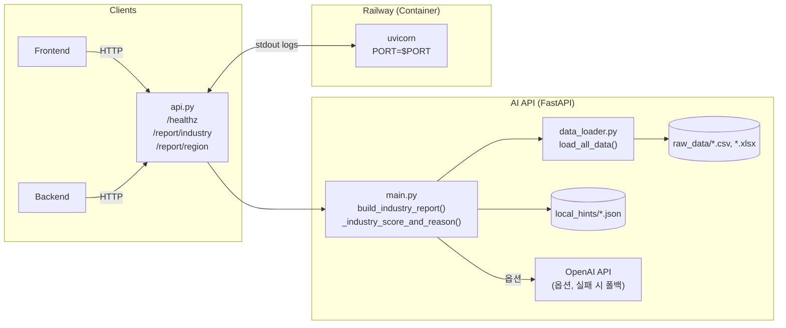
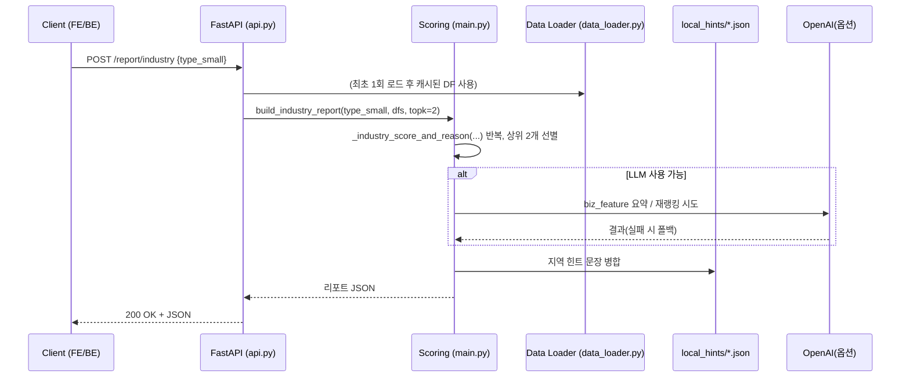

# LikeLion-13th-Assignment-Template
🦁 SKHU 멋쟁이사자처럼 13기 과제 PR 템플릿 레포지토리입니다.





```mermaid
flowchart TB
  Dev[로컬 개발] --> GH[GitHub Repo]
  GH --> CI[Railway Build]
  CI --> IMG[Container Image]
  IMG --> RUNTIME[Railway Runtime (asia-southeast1 ...)]
  RUNTIME -->|Public URL| User
```

# 헬스체크
curl -sS https://<your-public-url>/healthz

# 지역 리포트
curl -X POST https://<your-public-url>/report/region \
  -H "Content-Type: application/json" \
  --data '{"region":"전농1동"}'

# 업종 리포트 (topk는 서버에서 2로 고정)
curl -X POST https://<your-public-url>/report/industry \
  -H "Content-Type: application/json" \
  --data '{"sex":"남성","type_large":"음식","type_medium":"일식","type_small":"일식 면 요리","budget":"5000만원 이상"}'
